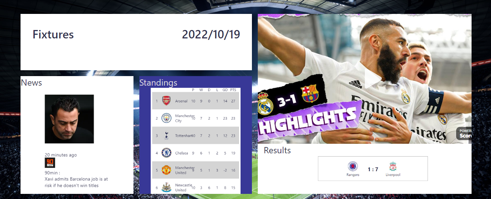

# Footbal


## About
A football information platformation that provides up to date fixtures, news, highlights, standings and results of the top football leages. data is fetched from football api which is updated every 15seconds.

## Technologies
project is creted witth:
 * react: "^18.2.0"
 * css

## Setup
To run this project, install it locally using npm:

```
$ npm install
$ npm start
```
## Demo
[demo](https://bamidelee.github.io/football)


